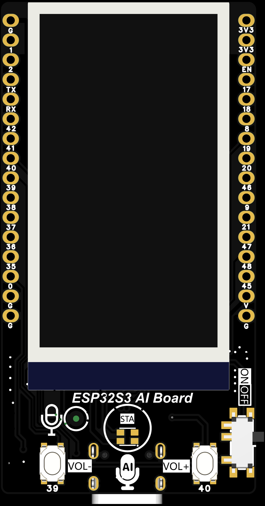
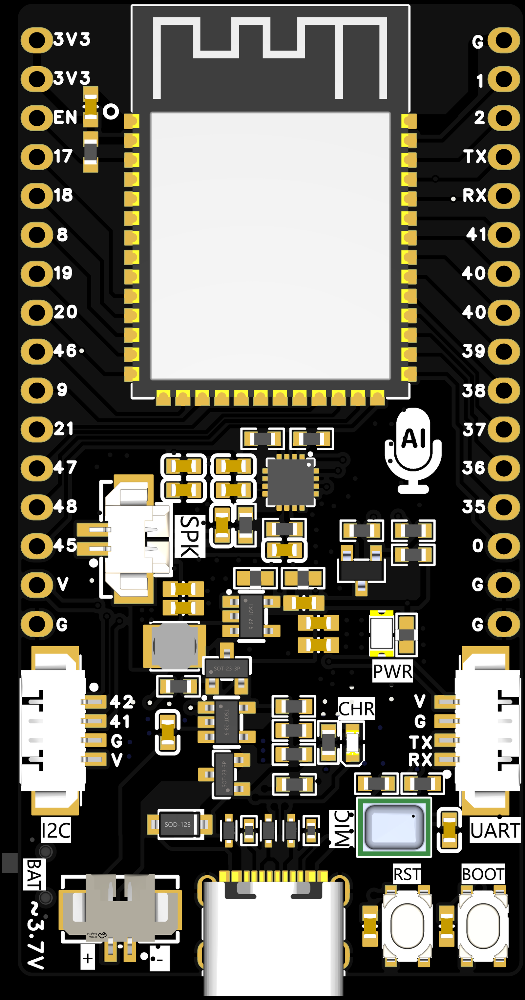

# ESP32-S3 AI Board 项目文档

## 硬件信息

| 项目 | 规格 |
|------|------|
| 开发板 | ESP32-S3 AI Board |
| 芯片 | ESP32-S3-WROOM-1 N16R8 (16MB Flash, 8MB PSRAM) |
| 屏幕 | ST7789 1.9 寸 IPS TFT (170×320) |
| LED | WS2812 RGB LED |
| 麦克风 | I2S 数字麦克风 |
| 音频输出 | I2S DAC |





---

## 引脚定义 (`include/pins.h`)

### 按键
| 引脚 | GPIO | 功能 |
|------|------|------|
| PIN_BTN_RST | EN | RST 复位按键 |
| PIN_BTN_BOOT | 0 | BOOT 按键 (AI 对话打断) |
| PIN_BTN_VOL_UP | 40 | 音量加 |
| PIN_BTN_VOL_DN | 39 | 音量减 |

### WS2812 LED
| 引脚 | GPIO | 功能 |
|------|------|------|
| PIN_LED_WS2812 | 48 | LED 控制 |
| LED_COUNT | 1 | LED 数量 |

### LCD 屏幕 (ST7789)
| 引脚 | GPIO | 功能 |
|------|------|------|
| PIN_LCD_SCLK | 12 | SPI 时钟 |
| PIN_LCD_MOSI | 10 | SPI MOSI |
| PIN_LCD_MISO | -1 | SPI MISO (不使用) |
| PIN_LCD_DC | 11 | 数据/命令选择 |
| PIN_LCD_CS | 13 | 片选 |
| PIN_LCD_RST | 14 | 复位 |
| PIN_LCD_BL | 3 | 背光 |

### 音频输出 (I2S DAC)
| 引脚 | GPIO | 功能 |
|------|------|------|
| PIN_I2S_BCLK | 15 | 位时钟 |
| PIN_I2S_LRCK | 16 | 左右声道时钟 |
| PIN_I2S_DIN | 7 | 数据输出 (DAC) |

### 麦克风 (I2S MIC)
| 引脚 | GPIO | 功能 |
|------|------|------|
| PIN_MIC_SCK | 5 | 麦克风时钟 |
| PIN_MIC_DATA | 6 | 麦克风数据 |
| PIN_MIC_WS | 4 | 麦克风电源控制 |

### 扩展接口 (I2C)
| 引脚 | GPIO | 功能 |
|------|------|------|
| PIN_I2C_SDA | 41 | I2C SDA |
| PIN_I2C_SCL | 42 | I2C SCL |

### 扩展接口 (UART0)
| 引脚        | GPIO | 功能    |
| ----------- | ---- | ------- |
| TXD | 43   | UART0 TX |
| RXD | 44   | UART0 RX|

### 扩展接口 (USB OTG)
| 引脚   | GPIO | 功能     |
| ------ | ---- | -------- |
| USB_D- | 19   | UART0 TX |
| USB_D+ | 20   | UART0 RX |

### 未使用/可用 GPIO

ESP32-S3 共有 45 个 GPIO (GPIO 0-21, GPIO 33-48)，本板未使用的 GPIO 如下：

| GPIO | 状态 | 备注 |
|------|------|------|
| 1 | ✅ 可用 | UART TX (可复用) |
| 2 | ✅ 可用 | 一般 GPIO |
| 8 | ✅ 可用 | 一般 GPIO  |
| 9 | ✅ 可用 | 一般 GPIO  |
| 17 | ✅ 可用 | 一般 GPIO |
| 18 | ✅ 可用 | 一般 GPIO |
| 21 | ✅ 可用 | 一般 GPIO |
| 33 | ✅ 可用 | 一般 GPIO |
| 34 | ✅ 可用 | 一般 GPIO |
| 35 | ✅ 可用 | 一般 GPIO |
| 36 | ✅ 可用 | 一般 GPIO |
| 37 | ✅ 可用 | 一般 GPIO |
| 45 | ✅ 可用 | 一般 GPIO |
| 46 | ✅ 可用 | 一般 GPIO |
| 47 | ✅ 可用 | 一般 GPIO |

**特殊说明：**
- **GPIO 0**: 已用于 RST 按键，启动时按下会进入下载模式
- **GPIO 9**: BOOT 按键
- **GPIO 4**: MIC_WS
- **GPIO 43/44**: USB D+/D- (内置 USB，不可用作一般 GPIO)
- **GPIO 48**: 已用于 WS2812 LED
- **GPIO 41/42**: 已用于 I2C 接口

### 推荐用于扩展的 GPIO

| 优先级 | GPIO | 说明 |
|--------|------|------|
| ⭐⭐⭐ | 17, 18, 21 | 无复用功能，推荐使用 |
| ⭐⭐ | 1, 2 | 可用于 UART 通信 |
| ⭐⭐ | 33-37 | 一般 GPIO，可用 |
| ⭐ | 45-47 | 可用 |

---

## 当前功能 (`src/main.cpp`)

### 1. 屏幕显示
- **分辨率**: 170×320，旋转 90 度使用
- **背景**: 黑色
- **标题**: "MIC FFT Spectrum" (白色文字)
- **FFT 频谱**: 32 个频带柱状图
  - 绿色：高度 < 50
  - 黄色：高度 50-100
  - 红色：高度 ≥ 100
- **音量显示**: 实时显示 RMS 音量百分比

### 2. 音频输出测试
- 启动时播放向上滑音 (440Hz → 880Hz)
- 使用 I2S 接口输出正弦波

### 3. 麦克风 FFT 频谱分析
- **采样率**: 16000 Hz
- **采样点数**: 256 点
- **FFT 算法**: Cooley-Tukey
- **显示频带**: 32 个
- **刷新率**: 实时

---

## 软件架构

```
xiaozhi_aiboard/
├── include/
│   ├── pins.h          # 引脚定义
│   ├── lgfx_setup.h    # LovyanGFX 屏幕配置
│   └── tft_setup.h     # TFT_eSPI 配置 (备用)
├── lib/                 # 外部库
├── src/
│   └── main.cpp        # 主程序
├── platformio.ini      # PlatformIO 配置
└── README.md           # 项目文档
```

---

## 依赖库 (`platformio.ini`)

```ini
lib_deps =
    adafruit/Adafruit NeoPixel    ; WS2812 LED 驱动
    lovyan03/LovyanGFX            ; 屏幕驱动
```

---

## 编译和上传

### 环境要求
- PlatformIO Core
- ESP32 平台支持

### 命令
```bash
# 编译
pio run

# 编译并上传
pio run -t upload

# 打开串口监视器
pio device monitor
```

### 串口参数
- 波特率：115200
- 端口：自动检测 (COM27)

---

## FFT 频谱显示参数

```cpp
#define SPECTRUM_WIDTH   300      // 频谱宽度
#define SPECTRUM_HEIGHT  140      // 频谱高度
#define SPECTRUM_X       10       // X 起始位置
#define SPECTRUM_Y       25       // Y 起始位置
#define NUM_BARS         32       // 频带数量

#define SAMPLE_COUNT     256      // FFT 采样点数
#define MIC_SAMPLE_RATE  16000    // 麦克风采样率
```

---

## 音频参数

### I2S 配置
| 参数 | 值 |
|------|-----|
| 采样率 | 16000 Hz |
| 位深度 | 16 bit |
| 声道 | 立体声 (输出) / 单声道 (输入) |
| I2S 模式 | 标准 I2S |

### 问候音
| 参数 | 值 |
|------|-----|
| 起始频率 | 440 Hz (A4) |
| 结束频率 | 880 Hz (A5) |
| 步进 | 20 Hz |
| 每步时长 | 50 ms |

---

## 使用方法

1. **上电启动**
   - 屏幕显示 "Hello, Screen!"
   - 播放向上滑音问候

2. **FFT 频谱显示**
   - 标题 "MIC FFT Spectrum" 固定显示
   - 32 个频带柱状图随声音实时变化
   - 底部显示当前音量百分比

3. **测试麦克风**
   - 对着麦克风说话或播放音乐
   - 观察频谱柱状图高度变化
   - 音量数值应随声音大小变化

---

## 调试信息

串口输出示例：
```
boot
DAC ready
Setting up MIC...
MIC setup complete!
LCD init...
LCD init ok
LCD ready.
Playing greeting tone...
Greeting done. Starting spectrum display...
```

---

## 常见问题

### 屏幕无显示
- 检查背光引脚 (GPIO 3) 是否正确
- 确认屏幕旋转设置 (LCD_ROTATION = 1)
- 验证 SPI 引脚连接

### 麦克风无信号
- 检查 I2S 麦克风引脚 (SCK=5, DATA=6, WS=4)
- 确认麦克风模块供电正常
- 检查 I2S 配置中的采样率和位深

### 音频无声
- 检查 DAC 连接和供电
- 验证 I2S 输出引脚 (BCLK=15, LRCK=16, DOUT=7)
- 确认扬声器/耳机阻抗匹配

---

## 版本历史

| 版本 | 日期 | 更新内容 |
|------|------|----------|
| 1.0 | 2026-02-22 | 初始版本：屏幕显示 + I2S 音频 + 麦克风 FFT 频谱 |

---

## 许可证

本项目用于 ESP32-S3 AI Board 硬件测试和功能验证。
